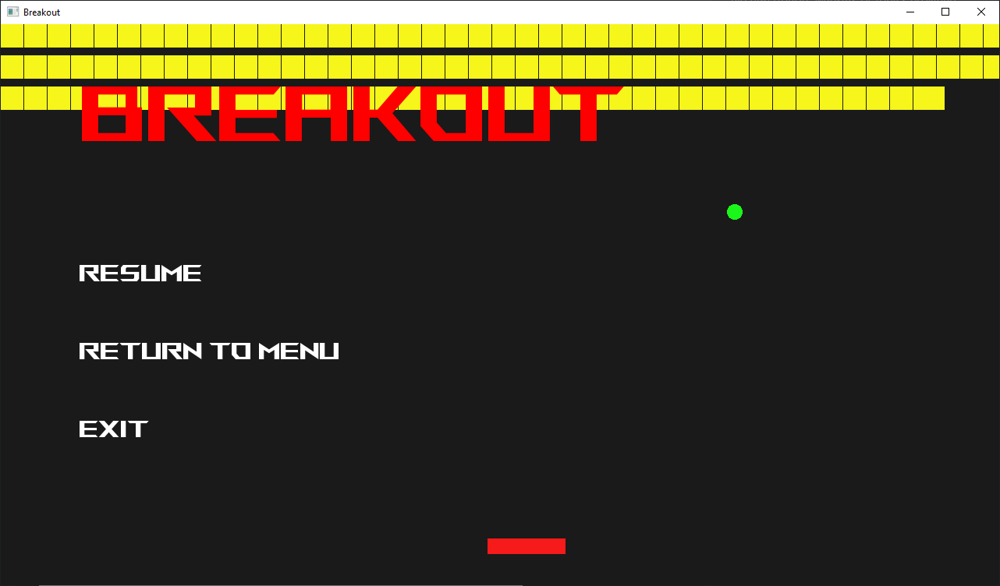
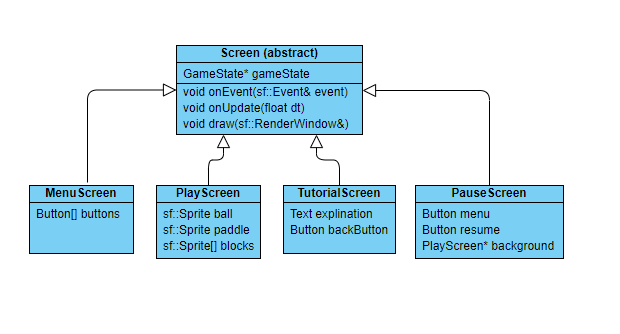

# CPTS_122-Final-Project
Partially functional version of breakout. Runs on windows only. 
Developed by Alex Sindledecker (section 4), Alec Barran (section 6), Alondra Romero (section 11), and Khoi Vu (section --)
## Download
To download, use `git clone https://github.com/Alex-Sindledecker/CPTS_122-Final-Project` in cmd or click the "code" button in the top right and then click "download as zip". No additional setup is required, paths to dependencies should be correctly setup by default.
### Screenshot

### Inheritance diagram
We came up with this inheritance diagram to allow multiple screens to be easily implemented

